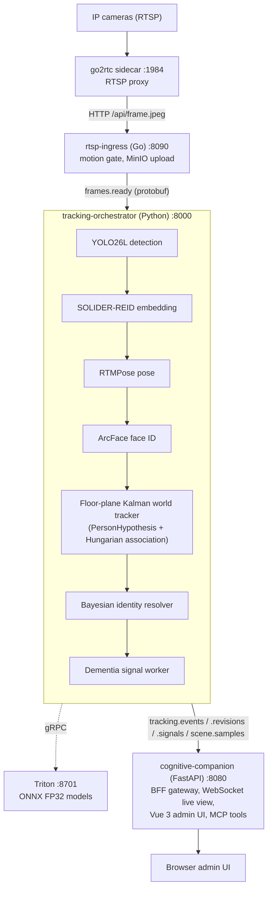
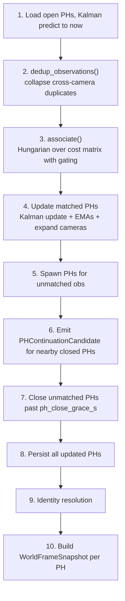

# CLAUDE.md

Guidance for Claude Code agents working in this repository.

---

## What This System Does

The **Continuous Tracking System (CTS)** monitors seniors with early dementia via RTSP cameras. It:

- Pulls camera streams via a go2rtc sidecar and uploads JPEG keyframes to MinIO
- Tracks individuals using a single floor-plane Kalman world tracker (PersonHypothesis entities, Hungarian association over calibrated floor positions)
- Re-identifies people across cameras using a Bayesian posterior over identity candidates (ArcFace face recognition + SOLIDER-REID body appearance)
- Detects dementia-relevant behavioural patterns: pacing, sundowning, bathroom anomaly, prolonged stillness, nighttime movement, unexplained absence
- Streams results via Redis Streams (protobuf wire format) to `cognitive-companion`, a BFF gateway that serves the Vue admin UI

---

## Design Documents

Design documents are tracked externally. The canonical reference for architecture decisions is this CLAUDE.md and the code itself.

The cross-project architecture reference is [docs/systems-architecture.md](docs/systems-architecture.md): the PersonHypothesis world-tracker model, the frame pipeline, the identity resolver and how priors update, home-camera nuances (synthetic floor points, calibration-aware dedup), the settings coupling rule, and the CTS-to-CC wire contract. The CC-side companion doc is [`../cognitive-companion/docs/systems-architecture.md`](../cognitive-companion/docs/systems-architecture.md).

---

## System Architecture



**Infrastructure**: TimescaleDB + pgvectorscale (StreamingDiskANN) · Redis Streams (AOF) · MinIO · Triton Inference Server

**GPU support**: NVIDIA only (TensorRT/CUDA execution provider via ONNX Runtime).

**Shared libraries**: `triton-shared/` (sibling) provides the Triton gRPC client (`TritonClientProtocol`, `TritonGrpcClient`) and inference pre/post-processing used by both CTS and `scene-analysis-service`.

---

## Repository Layout

```text
.
├── rtsp-ingress/                  Go RTSP ingest service
│   ├── cmd/server/                Entry point
│   ├── internal/config/           Config loading (service settings from YAML + env vars)
│   ├── internal/go2rtc/           go2rtc HTTP API client
│   ├── internal/motion/           Motion gating (pixel diff)
│   ├── internal/media/            MinIO upload + Redis Streams publish
│   ├── internal/metrics/          Prometheus metrics
│   ├── internal/poll/             Camera config polling worker
│   ├── internal/reconciler/       Camera state reconciliation
│   ├── internal/streams/          Stream lifecycle management
│   └── internal/supervisor/       Runtime supervisor
├── tracking-orchestrator/         Python ML orchestration service
│   ├── app/domain/                Frozen dataclasses (Detection, WorldObservation, PersonHypothesis, …)
│   ├── app/inference/             Triton gRPC client (delegates to triton_shared) + ReID/Pose wrappers
│   ├── app/tracking/              world tracker (world/: Kalman, association, cost matrix, dedup), identity resolver
│   ├── app/trajectory/            Trajectory writer, dementia signal detectors, posture classifier, motion energy, robust stats
│   ├── app/transport/             Redis Streams codec (protobuf), publishers
│   ├── app/cli.py                 ``cts-db`` migration CLI (migrate / rollback / status)
│   ├── app/storage/               Repository protocols, InMemory impls, Postgres impls, MigrationRunner
│   ├── app/routers/               Internal FastAPI endpoints (dashboard, live, calibration, gallery, corrections, trajectory)
│   ├── app/observability/         Prometheus metrics
│   ├── app/calibration/           Homography calibration state
│   ├── app/sampling/              Keyframe sampler
│   ├── app/pipeline/              Frame processing pipeline (detection, tracking, pose, ReID, privacy enforcement)
│   ├── app/proto/                 Generated protobuf Python bindings (committed)
│   └── migrations/                SQL migrations (0001_init baseline; .up.sql/.down.sql pairs)
├── triton-models/                 Triton model configs + export/download scripts
│   ├── person-detector/           YOLO26L ONNX (FP32)
│   ├── clip-vision/               CLIP ViT-L/14 ONNX (FP32)
│   ├── florence-2/                Florence-2-large Python backend (INT8 HF export)
│   ├── reid-solider/              SOLIDER-REID ONNX
│   ├── pose-rtmpose/              RTMPose-m ONNX
│   └── scripts/                   export, download
├── proto/                         Protobuf contracts (frame, tracking, signals, scene)
├── cognitive-companion/           BFF gateway (sibling repo -- see its own CLAUDE.md)
├── k8s/                           Legacy K8s (migrated to ../kubernetes/continuous-tracking/)
├── docs/                          Runbook, wire-format spec
├── ../kubernetes/                 Unified K8s manifests (nanai namespace)
└── triton-shared/                 Shared Triton client + inference utilities (sibling)
```

---

## Code Architecture Patterns

### Layering (strictly enforced by import-linter)

```text
core → domain → storage → services → transport → routers
```

Nothing above `storage` may import a concrete `Postgres*` class. Services depend only on `Protocol` interfaces. Import-linter runs at CI and in pre-commit hooks.

### Storage: Protocol + InMemory + Postgres triplet

Every persistent resource in `tracking-orchestrator` has three artifacts:

1. **`Protocol`** in `storage/base.py` -- the contract services depend on
2. **`InMemory*`** in the same file -- zero-dependency, used in all unit tests
3. **`Postgres*`** in `storage/postgres/` -- production asyncpg implementation

The shared PostgreSQL instance (`timescale/timescaledb-ha:pg18`) hosts the `continuous_tracking` database alongside `cognitive_companion` and `semantic_memory`. The database and a dedicated `continuous_tracking` schema are created by `../db/db/init-databases.sh` (mounted at `/docker-entrypoint-initdb.d/`). Every table, index, trigger, and function lives in the `continuous_tracking` schema -- nothing goes to `public`. Per-app SQL migrations are managed by `MigrationRunner` (`app/storage/migrations.py`), which uses `pg_try_advisory_lock` for multi-replica safety and an `.up.sql` / `.down.sql` convention for explicit rollback.

```python
# storage/base.py
class PHRepositoryProtocol(Protocol):
    async def save(self, ph: PersonHypothesis) -> None: ...
    async def get(self, ph_id: str) -> PersonHypothesis | None: ...
    async def list_open(self) -> list[PersonHypothesis]: ...
    async def update_identity(self, ph_id: str, identity_id: str, committed_at: datetime) -> None: ...
```

Rules:

- All repository methods are `async`.
- Return domain types, never raw DB rows.
- `Protocol` carries no state.
- `InMemory` uses plain `dict`/`list`; never touches a DB.
- `Postgres*` receives only an `asyncpg.Pool`; holds no other state.

### Domain objects: frozen dataclasses

Internal domain objects are `@dataclass(frozen=True)`. They carry no validation logic -- validation happens at service boundaries via Pydantic v2. Never mutate a frozen dataclass; use a side-channel dict keyed by `id(obj)` for transport metadata (e.g., Redis message IDs).

### Go: interface contracts

Each subsystem in `rtsp-ingress/internal/` exports an interface as its public API. Tests inject a fake; production wires the real implementation. Define interfaces in the **consumer** package, not the provider.

### RTSP ingest: go2rtc sidecar

`rtsp-ingress` does **not** manage RTSP sessions directly. go2rtc owns all RTSP sessions. The flow per camera:

1. `reconciler` fetches the enabled camera list from `GET /api/v1/cts/cameras` on cognitive-companion (polled every 60 s)
2. `Supervisor.Reconcile()` calls `go2rtc.RegisterStream(ctx, cameraID, rtspURL)` -- idempotent HTTP PUT to go2rtc `/api/streams`; heals go2rtc restarts
3. `poll.Worker` ticks every `frame_interval_ms` ms and calls `go2rtc.FetchJPEG(ctx, cameraID)` -- HTTP GET `/api/frame.jpeg`
4. Frame passes motion gate, uploads to MinIO, publishes to `frames.ready`

`rtsp-ingress/config/go2rtc.yaml` has **no `streams:` section** -- all registrations are dynamic. Do not add `gortsplib` or `pion/rtp` to this codebase.

### WorldTracker.step: the 10-step loop

Each frame, `WorldTracker.step` (`app/tracking/world/tracker.py`) runs:



### Identity resolution: Bayesian posterior

The identity resolver maintains a posterior probability distribution over `{known_identities ∪ UNKNOWN}` for each PersonHypothesis (PH). Evidence sources:

- **Face anchors** (ArcFace similarity → likelihood update)
- **ReID gallery** (SOLIDER-REID embedding → pgvector HNSW nearest-neighbour search)
- **Temporal prior** (continuity from prior frame's assignment)

A commit fires only when `prob ≥ threshold AND margin ≥ min_margin AND sensory_evidence_present`. The temporal prior alone cannot trigger a commit -- face or ReID evidence must be present. Parameter: `commit_prob = 0.65`.

Retroactive revision: when a committed identity is later overturned, an `IdentityRevision` is published to `tracking.revisions`, the `PersonLocationHistory` row in cognitive-companion is soft-deleted (`superseded_by_revision_id` stamped), and a replacement row is inserted.

---

## Approved Libraries

### Python (`tracking-orchestrator/pyproject.toml`)

| Library | Role |
| --- | --- |
| `fastapi` | HTTP router and dependency injection |
| `pydantic v2` | Validation at all external boundaries (HTTP, config, Redis payloads) |
| `asyncpg` | Async Postgres driver -- `$1..$N` positional params always |
| `redis[hiredis]` | Async Redis Streams client -- consumer groups + XACK |
| `aiobotocore` | Async S3-compatible client for MinIO |
| `structlog` | Structured JSON logging -- never `logging.getLogger` or `print` |
| `numpy` | Frame data and embedding arithmetic |
| `opencv-python-headless` | Image preprocessing -- `cv2.resize(INTER_LINEAR)` for all letterbox/crop resizing |
| `scipy` | Hungarian assignment (`linear_sum_assignment`) for tracking; robust statistics for baselines |
| `shapely>=2.0` | Polygon containment for privacy zone enforcement |
| `protobuf` | Message contracts; generated bindings committed in `app/proto/` |
| `prometheus-client` | Metrics exposition at `GET /metrics` |
| `pytest` + `pytest-asyncio` | Test runner; all repo tests are `async def` |
| `mypy` (strict) | Type checking on `domain/`, `storage/`, `services/`, `transport/` |
| `ruff` | Lint + format |
| `import-linter` | Layering enforcement |
| `triton-shared` | Shared Triton client + YOLO/CLIP/Florence pre/post-processing (path dep at `../../triton-shared`) |

Do not introduce `aiohttp`, `celery`, or `psycopg2`. `httpx` is permitted as a **dev-only** dependency.

### Go (`rtsp-ingress/go.mod`)

| Library | Role |
| --- | --- |
| `minio/minio-go/v7` | S3-compatible object storage client |
| `redis/go-redis/v9` | Redis Streams producer |
| `prometheus/client_golang` | Metrics exposition |
| `go.uber.org/zap` | Structured logging -- `zap.L()` for global logger |
| `google.golang.org/protobuf` | Protobuf runtime |
| `golang.org/x/image` | Image format decoding in media processing |
| `gopkg.in/yaml.v3` | Config file parsing |

Do not add `bluenviron/gortsplib` or `pion/rtp` -- RTSP is delegated to go2rtc.

---

## Redis Stream Wire Format

All streams carry raw protobuf bytes -- no JSON, no base64. Use `transport/codec.py`:

```python
from app.transport.codec import encode, decode

# publish
await redis.xadd("tracking.events", encode(event_msg, field="event"))

# consume
event = decode(fields, TrackingEvent, field="event")
```

| Stream | Field | Message type |
| --- | --- | --- |
| `frames.ready` | `"frame"` | `FrameReady` |
| `tracking.events` | `"event"` | `TrackingEvent` |
| `tracking.revisions` | `"revision"` | `IdentityRevision` |
| `tracking.signals` | `"signal"` | `DementiaSignal` |
| `scene.samples` | `"sample"` | `SceneSample` |

Redis clients must set `decode_responses=False` so binary payloads round-trip unchanged.

---

## Database Migrations

Migrations live in `tracking-orchestrator/migrations/` as numbered `.up.sql` / `.down.sql` pairs. The `MigrationRunner` (`app/storage/migrations.py`) tracks applied state in `continuous_tracking._schema_version` and uses `pg_try_advisory_lock` so only one replica runs migrations at a time.

**Schema convention**: Every DDL object (tables, indexes, triggers, functions, materialized views) belongs to the `continuous_tracking` schema. `0001_init.up.sql` opens with `SET search_path = continuous_tracking, public;` so unqualified `CREATE TABLE` / `CREATE INDEX` / TimescaleDB function calls all land in the correct schema. All Python-side SQL in `storage/postgres/` explicitly qualifies table references (e.g., `FROM continuous_tracking.dementia_signals`).

Migrations run automatically at orchestrator startup (backward-compatible) and can also be invoked standalone:

```bash
cts-db migrate          # apply pending up migrations
cts-db rollback -n 1    # roll back last migration
cts-db status           # show applied / pending
```

| File | Contents |
| --- | --- |
| `0001_init` | Complete baseline schema: all tables, hypertables, indexes, triggers, continuous aggregate, and retention policy. Squashes 20+ prior migrations plus U1 quality capture and PH-native cleanup. Drop and recreate the database to migrate from an older chain. |

**Pre-release lifecycle:** All schema changes fold into `0001_init.up.sql`. No incremental files exist. Existing dev databases must be dropped and recreated.

**Post-release lifecycle:** Each atomic change gets its own `NNNN_description.up.sql` / `NNNN_description.down.sql`. Rollbacks are supported.

**DATABASE_URL**: asyncpg expects a plain `postgresql://` DSN. If a `postgresql+asyncpg://` (SQLAlchemy-style) URL is provided, the `_normalize_dsn()` helper strips the `+asyncpg` prefix automatically.

---

## Coding Rules

These rules come from bugs caught during implementation and are non-negotiable.

### Python / asyncpg

**`$N` placeholders always.** asyncpg uses `$1, $2, …` positional params. Never use `%s` or `?`. `executemany` also requires `$N` style -- one row's worth of placeholders per statement.

**`datetime.now(UTC)` always.** `from datetime import UTC`. Bare `datetime.now()` produces timezone-naive objects that break TimescaleDB `timestamptz` columns.

**Declare all attributes in `__init__`.** Every attribute must be present in `__init__` with its correct `Optional[T] | None` type, even if set later. Attributes first assigned outside `__init__` cause `AttributeError` and mypy cannot track them.

**Never mutate frozen dataclasses.** `@dataclass(frozen=True)` raises `FrozenInstanceError` on `instance.attr = value`. For transport metadata (e.g., Redis message IDs) alongside frozen domain objects, maintain a side-channel `dict[int, T]` keyed by `id(obj)`.

**Stable signal IDs.** Dementia signals use `uuid.uuid5(NAMESPACE_URL, "{identity_id}\x00{signal_kind}\x00{window_start}\x00{window_end}")` so the same detection window always maps to the same UUID. This makes the `ON CONFLICT` upsert idempotent on retry.

### SQL correctness

**Schema-qualify every table reference.** All tables, views, and materialized views live in the `continuous_tracking` schema. Every SQL statement in `storage/postgres/` must write `continuous_tracking.<table>` (e.g. `FROM continuous_tracking.dementia_signals`, `INSERT INTO continuous_tracking.person_hypotheses`). Never rely on `search_path` to resolve unqualified names; the Python application queries span many sessions and the search_path is only set during migration execution.

**PostgreSQL array concatenation is `||`.** In `ON CONFLICT DO UPDATE SET`, write `col = EXCLUDED.col || table.col`. The `array[...]` constructor is for array literals only -- wrapping a `||` expression in it is a syntax error.

**Anchor conditional SQL replacements.** When adding `AND extra_clause` to a query via `str.replace`, replace a unique substring that includes the insertion point. Never replace a trailing keyword like `LIMIT 100` and prepend `AND …` -- that produces invalid SQL (predicate after `ORDER BY`).

**Match bind parameter count exactly.** Count `$1..$N` placeholders and verify the argument tuple has the same arity. Off-by-one raises `ValueError: bind parameter $N not found` at runtime.

### Tracking / data structures

**Use `.items()` when you need both key and value.** Build `active_tracks` with `[(key, val) for key, val in d.items() if …]` and return keys from assignment functions. `enumerate(dict.values())` gives positions that diverge from key names after any deletion.

**Explicit reverse maps for cross-namespace lookups.** When two modules use different ID namespaces for the same entity (e.g., `local_track_id` strings vs. UUID `tracklet_id`s), maintain an explicit `dict[local_id, uuid_id]` reverse map on the owning object.

**One increment per code path.** An unconditional increment followed by a conditional second increment silently doubles the count on the non-threshold branch.

**Prefer method parameters over placeholder fields.** If a helper receives `embedding` as a parameter and the detection also has a placeholder `detection.embedding`, use the parameter -- it carries the live Triton value.

**Sort trajectory windows ascending.** Dementia signal detectors need time-ordered points to compute distances and direction changes correctly.

### Go

**go2rtc owns all RTSP sessions.** Use `go2rtc.Client` -- `RegisterStream`, `DeregisterStream`, `FetchJPEG`. Never open raw RTSP connections in Go.

**Wrap every error with context.** `fmt.Errorf("streams: register %q: %w", cfg.ID, err)`.

**Check every error.** `go vet` and `golangci-lint` flag unchecked returns -- treat them as compile errors.

**`context.Context` first.** Every function that does I/O takes `ctx context.Context` as its first parameter and respects cancellation via `ctx.Err()`.

---

## Engineering Standards

| Area | Standard |
| --- | --- |
| Python version | 3.12; `from __future__ import annotations` in every file |
| Type checking | `mypy --strict` on `domain/`, `storage/`, `services/`, `transport/` |
| Go version | 1.24+ (toolchain pinned in `.tool-versions`; install with `make go-install`) |
| Go safety | `-race` mandatory in all test runs; `go vet`; `golangci-lint` |
| Protobuf | `buf lint`; `buf breaking` against last merged commit; generated bindings committed |
| Logging | `structlog` in Python (`get_logger(__name__)`); `zap.L()` in Go. Include `camera_id`, `ph_id` in every relevant log line. |
| Timestamps | Always timezone-aware. Python: `datetime.now(UTC)`. Go: `time.Now().UTC()`. |
| Image resize | `opencv-python-headless` `cv2.resize(INTER_LINEAR)`. Never hand-roll bilinear in NumPy. |
| Secrets | In environment variables or `.env` files (never committed). YAML holds defaults; env overrides. |
| SQL injection | asyncpg `$N` params only. Never build SQL with f-strings or `%`. |
| Error taxonomy | Domain errors use the project's `ErrorCode` enum. No stack traces in API responses -- log locally, return only code + message. |
| Metrics | Prometheus via `prometheus-client` (Python) and `prometheus/client_golang` (Go). Register in the respective `metrics.py` / `metrics.go` files. |

---

## Testing Strategy

### Python

- Unit tests inject `InMemory*` implementations directly -- never mock `asyncpg.Pool` or Redis.
- All tests touching a repository are `async def` (configured with `asyncio_mode = "auto"`).
- Triton calls are mocked via `TritonClientProtocol` -- all inference tests run without a GPU.
- Use `pytest.fixture` for shared domain objects; do not construct the same frozen dataclass inline in multiple tests.
- Test only through the public API of the class under test -- never assert on private `_attributes`.
- Integration tests (real Postgres + Redis) are in `tests/integration/` and skipped by default.

### Go (rtsp-ingress tests)

- Table-driven tests (`t.Run`) for functions with multiple input/output cases.
- Inject interfaces in constructors -- tests replace the real implementation.
- Always run with `-race`: `go test -race ./...`. Hard CI gate.
- HTTP handler tests use `httptest.NewRecorder()`.
- go2rtc calls are tested with `httptest.Server` serving mock responses.

---

## Quality Gate

Run before every PR. CI runs the same checks.

```bash
make check        # Python: ruff check + ruff format --check + mypy + import-linter + pytest (fast local gate)
make all-check    # Python + Go (golangci-lint + go test -race + go build) + buf lint
make ci           # Authoritative gate: all-check + integration proofs (requires Docker)
```

**`make ci` is the authoritative gate.** `make check` is the fast local gate; `make all-check` adds Go and proto validation. `make ci` additionally runs `pytest -m integration` which proves C1/C2 (WorldTracker end-to-end) and T5 (PH repository parity) against a testcontainer Postgres. These proofs must pass before merging any change to the tracker or storage layer.

Install pre-commit hooks (ruff, mypy, golangci-lint, buf):

```bash
pre-commit install
```

**Always use the project venv** at `tracking-orchestrator/.venv/`. The Makefile uses it automatically. Sync dependencies with:

```bash
cd tracking-orchestrator && uv sync --frozen --extra dev
```

---

## Proto Codegen

Generated bindings are **committed to the repo** -- do not gitignore them. Regenerate after changing `.proto` files:

```bash
make proto          # Go (buf generate) + Python (protoc --python_out --pyi_out)
make proto-lint     # buf lint only
```

Requires `protoc >= 25` (`apt install protobuf-compiler`) and the project Go toolchain (`make go-install`). The `proto-py` target writes to both `tracking-orchestrator/app/proto/` and `../cognitive-companion/backend/integrations/proto/`.

---

## Camera Configuration

All cameras are managed through the cognitive-companion Admin UI (`/admin/cts/cameras`). There is no static camera list in `settings.yaml`.

rtsp-ingress polls `GET /api/v1/cts/cameras` on cognitive-companion every 60 s (configurable via `cognitive_companion.reconcile_interval_s`). The reconciler maps each camera record to a `CameraConfig` and calls `Supervisor.Reconcile()`, which registers/deregisters streams with go2rtc idempotently.

`CameraConfig` fields populated from the API response:

| Field | Source |
| --- | --- |
| `ID` | `cts_cameras.id` |
| `RTSPURL` | `cts_cameras.rtsp_url` -- full RTSP URL stored in the database |
| `RoomName` | `cts_cameras.location` |
| `Enabled` | only enabled cameras are included (filtered Go-side) |
| `FrameIntervalMs` | falls back to `defaults.frame_interval_ms` from settings.yaml |
| `MotionThreshold` | falls back to `defaults.motion_threshold` |
| `ReconnectBackoffSeconds` | falls back to `defaults.reconnect_backoff_s` |

rtsp-ingress authenticates to cognitive-companion with the `COGNITIVE_API_KEY` environment variable (sent as `X-API-Key`). The key must have the `cts_ingress` permission defined in `cognitive-companion/config/auth.yaml`. The `CC_INGRESS_API_KEY` env var should hold the same secret on both services.

RTSP credentials are stored in the cognitive-companion database as part of the full RTSP URL. They are never written to any config file on the rtsp-ingress side.

The CLAUDE.md for the `rtsp-ingress` architecture note:

```text
RTSP ingest: go2rtc sidecar
  1. reconciler fetches CameraConfig list from cognitive-companion API
  2. Supervisor.Reconcile() calls go2rtc.RegisterStream() -- idempotent PUT, heals restarts
  3. poll.Worker ticks every frame_interval_ms and calls go2rtc.FetchJPEG()
  4. Frame passes motion gate, uploads to MinIO, publishes to frames.ready
```

---

## Known Tech Debt

| ID | Severity | Description |
| --- | --- | --- |
| TD-003 | Medium | Revision stream consumer group pre-created by publisher instead of admin tooling |
| TD-006 | Low | `tracking.responses` stream (FrameResponse proto) has publisher but no consumer |
| TD-007 | Low | `PersonTrackingService` (CC) and CTS identity resolver run parallel identity paths; face anchors from person-identification-service are now integrated (Phase 2, May 2026) but not yet validated end-to-end |
| TD-008 | Medium | DepthEstimator (`app/inference/depth.py`) is implemented and importable but not wired into the live frame pipeline. It is used only during homography auto-calibration. M7 (Occluded Posture Detection) will wire it into the posture slow-path. Do not connect it to `FrameProcessingPipeline` before M7 is complete. |
| TD-009 | Low | ReID crop invariant: `_crop_detection()` in `frame_pipeline.py` must always be called before `ReidEmbedder.embed_batch()`. Any refactor that moves or merges these calls must preserve this ordering or the gallery distances become meaningless. |

---

## Working in This Repository

- **cognitive-companion** is a dependent system in a sibling directory (`../cognitive-companion`). Its own CLAUDE.md is required reading before touching anything under `cognitive-companion/`.
- **scene-analysis-service** shares the Triton instance and the `triton-shared/` client library. Changes to `triton-shared/` affect both CTS and SAS.
- **Model binaries are not in git.** Run the export/download scripts and place outputs in `triton-models/<model>/1/`. See `triton-models/README.md`. Models run as FP32 ONNX; no quantization.
- **Triton inference code** in `app/inference/` delegates to `triton_shared.client` and `triton_shared.inference`. CTS-specific wrappers (`PersonDetector`, `ReidEmbedder`, `PoseEstimator`) remain in `app/inference/`; shared logic lives in `triton-shared/`.
- **Never implement a feature that depends on another in-flight PR.** The layering is load-bearing.
- **Validation gates** (phase-0 §0.31) define binary pass/fail criteria for each subsystem. Any PR touching a subsystem must satisfy the relevant gates.
