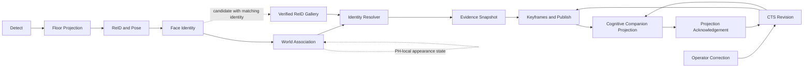

# Identity Integrity Program Baseline

Status: accepted architecture baseline captured from the workspace on 2026-06-19.

This document records current behavior and ownership. It does not authorize a runtime, schema,
configuration, or production-data change. Target behavior is defined by the three identity ADRs in
this directory.

## Data flow

The boundaries are load-bearing:

- world association owns physical observation-to-PH assignment;
- the resolver consumes evidence but does not create a second tracker;
- raw inference is immutable;
- effective identity is a revision-aware projection;
- only governed learning data enters the ReID gallery;
- CTS owns revisions and Cognitive Companion acknowledges projections.

## Existing and planned schema ownership

All CTS objects below exist in
`tracking-orchestrator/migrations/0001_init.up.sql` under the
`continuous_tracking` schema. The CC objects exist in
`backend/alembic/versions/0001_baseline.py`.

The gallery table is `continuous_tracking.reid_gallery`. There is no `identity_gallery` table.

| Object | Current purpose | Current writer | Planned identity owner |
| --- | --- | --- | --- |
| `continuous_tracking.person_hypotheses` | Persistent world PH and mutable current identity | CTS world tracker and PH repository | CTS association state; M02 adds the independent-evidence clock |
| `continuous_tracking.world_observations` | Observation history linked to a PH | CTS world tracker | CTS immutable observation boundary source for corrections |
| `continuous_tracking.reid_gallery` | 768-dim body embedding rows with `face_confirmed` | CTS gallery repository and multiview seeding | CTS governed gallery; M05 adds three-state lifecycle and provenance |
| `continuous_tracking.tagged_keyframes` | One row per sampling trigger, referencing a raw frame | CTS keyframe sampler | CTS physical-frame read model; M07 groups trigger rows |
| `continuous_tracking.keyframe_bbox_annotations` | Every persisted bbox for a sampled frame | CTS keyframe sampler | CTS bbox-level inferred and effective identity projection |
| `continuous_tracking.ph_revisions` | Existing PH identity revision audit | CTS correction and resolver stack | CTS immutable revision lineage; M06 extends bounded ranges and jobs |
| `CtsIdentityRevisionLog` / `cts_identity_revision_log` | CC record of applied CTS revision IDs | CC identity revision subscriber and rewriter | CC projection acknowledgement and audit |
| `PersonLocationHistory` / `person_location_history` | CC location history with supersession lineage | CC person-location and identity rewriter services | CC revision-aware location projection; `person_id` remains live |
| `identity_decisions` | Not present | M04 | CTS durable inferred/effective decision provenance |
| `identity_evidence_items` | Not present | M04 | CTS normalized evidence provenance |
| `identity_decision_gallery_hits` | Not present | M04 | CTS decision-to-gallery contributor provenance |
| `gallery_review_events` | Not present | M05 | CTS immutable gallery review audit |
| correction jobs, ranges, acknowledgements | Not present | M06 | CTS correction orchestration and projection status |

Every future CTS DDL object uses `continuous_tracking`, opens its migration with
`SET search_path = continuous_tracking, public;`, and schema-qualifies references. Python SQL in
`app/storage/postgres/` also uses fully qualified table names.

## Current configuration baseline

Source files:

- `continuous-tracking/tracking-orchestrator/config/settings.yaml`
- `person-identification-service/config/settings.yaml`
- `cognitive-companion/config/settings.yaml`

| Setting | Current value | Mode and identity consequence |
| --- | --- | --- |
| `face_id.enabled` | `true` | Live ArcFace calls enabled |
| `face_id.min_confidence` | `0.6` | Current anchor emission gate; value is raw service `confidence` |
| `resolver.face_commit_min_confidence` | `0.70` | Current face-lock gate; still uncalibrated |
| `resolver.commit_prob` / `commit_margin` | `0.65` / `0.15` | Live posterior commit thresholds |
| `resolver.commit_prob_dense` / `commit_margin_dense` | `0.80` / `0.20` | Live dense-scene thresholds |
| `resolver.prior_weight` | `0.6` | Live temporal-prior weight |
| `resolver.prior_maintenance_max_age_s` | `120.0` | Live value; target authority window is 30 seconds in M02 |
| `resolver.enable_quality_gate` | `true` | Authoritative gate enabled |
| `resolver.enable_flip_debounce` | `true` | Authoritative debounce enabled |
| `resolver.enable_sticky_maintenance` | `true` | Authoritative sticky hold enabled |
| `resolver.enable_duplicate_active_identity_guard` | `false` | Shadow-only comparison and mismatch metric; invariant is not enforced |
| `resolver.duplicate_identity_direct_face_min_confidence` | `0.90` | Shadow guard bypass threshold |
| `resolver.enable_embedding_coherence_boost` | `false` | Live boost disabled; comparison path exists in resolver |
| `resolver.enable_multiview_gallery` | `true` | Live max-over-view gallery queries and seeding enabled |
| `resolver.seed_orientation_min_confidence` | `0.5` | Live gallery seed orientation gate |
| `pipeline.adaptive_reid.enabled` | `false` | Live inference skipping disabled |
| `pipeline.adaptive_reid.shadow` | `true` | Shadow-only adaptive cadence evaluation |
| `pipeline.identity.rewrite_on_face_commit` | `true` | Live automatic rewrite behavior |
| `sampler.keyframe_min_interval_s` | `30.0` | Live per-PH periodic keyframe interval |
| `recognition.threshold` | `0.4` | Person service raw-cosine recognized threshold |
| `recognition.unknown_threshold` | `0.25` | Person service raw-cosine unrecognized threshold |

Only adaptive ReID cadence and the duplicate-active guard are explicitly shadow-only in the
current configuration. M00 does not flip either flag.

## Docker and infrastructure ownership

All services join the external `nanai` Docker network.

| Service | Compose owner | Host port | Database or state | Identity responsibility |
| --- | --- | --- | --- | --- |
| PostgreSQL | `db/docker-compose.db.yml` | `${POSTGRES_PORT}` to `5432` | `continuous_tracking`, `cognitive_companion`, `person_identification` | Separate schemas/databases per service |
| Redis | `continuous-tracking/docker-compose.yml` | `6379` | `redisdata` | Raw stream transport and consumer state |
| Triton | `continuous-tracking/docker-compose.yml` | `8700`, `8701`, `8702` | model mounts and `hf-cache` | Person detector, SOLIDER ReID, pose, ArcFace graphs |
| Tracking orchestrator | `continuous-tracking/docker-compose.yml` | `8500` | `continuous_tracking` | PH, resolver, gallery, keyframe, correction source of truth |
| RTSP ingress | `continuous-tracking/docker-compose.yml` | `8090` | Redis and external MinIO | Publishes frames and `FrameReady` |
| go2rtc | `continuous-tracking/docker-compose.yml` | `1984` | `go2rtc-config` | Camera session proxy |
| Cognitive Companion backend | `cognitive-companion/docker-compose.yml` | `8000` | `cognitive_companion`, `backend-data` | BFF and downstream revision projections |
| Cognitive Companion frontend | `cognitive-companion/docker-compose.yml` | `8081` | none | Caregiver identity administration |
| Person Identification | `person-identification-service/docker-compose.yml` | `8200` | `person_identification` | ArcFace enrollment and identification contract |
| MinIO | external to these compose files | deployment-defined | shared `${MINIO_BUCKET}` | Raw frames and future governed crops |

RTSP ingress stores source JPEGs under
`frames/{camera_id}/{YYYY/MM/DD/HH}/{frame_index}-{capture_time}.jpg`. A keyframe stores that raw
`frames/...` object key. It is metadata pointing to the physical source frame, not a separately
rendered image. M05 review crops use separate immutable crop keys.

## Redis streams relevant to identity

The normative wire format is one raw protobuf value per stream entry. The complete ownership and
compatibility table is in
`../../../docs/identity-integrity-contract-matrix.md`.

The `cc.identity_assertions` producer (live as of M38) and consumer are a known exception: they exchange
individual text fields rather than one protobuf payload. M00 records this defect but does not alter
the live path. Its fix requires a coordinated producer/consumer cutover because dual-codec stream
shims are prohibited.

## Synthetic characterization baseline

No fixture contains household names, media, URLs, credentials, or captured embeddings.

| Defect | Fixture | Removal milestone |
| --- | --- | --- |
| Two visible people with exchanged labels | `tests/fixtures/identity_integrity/two_person_handoff.json` | M03 |
| One physical person handed between two PHs | same fixture, second scenario | M03 and M06 |
| Duplicate active identity contenders | `tests/fixtures/identity_integrity/duplicate_active_identity.json` | M02 |
| Prior-only timestamp renewal | `tests/fixtures/identity_integrity/prior_only_timestamp_renewal.json` | M02 |
| Recognized face conflicts with gallery seed label | `tests/fixtures/identity_integrity/gallery_seed_identity_mismatch.json` | M05 |
| Two bbox identities collapse to one trigger identity | CC `tests/fixtures/identity_integrity/keyframe_identity_collapse.json` | M07 |
| Missing calibration artifact | person service `tests/fixtures/identity_integrity/missing_calibration_artifact.json` | M10 |

Strict xfails state the desired invariant and name the milestone that removes them. An unexpected
pass fails the suite so the xfail cannot silently outlive its defect.

## Privacy boundary

Committed fixtures are synthetic. Private household images, crops, embeddings, populated
manifests, presigned URLs, and production exports remain local. M11 adds and verifies explicit
ignore patterns alongside the private replay tooling. Until then, every identity-integrity change
must audit all three repository statuses before handoff.

## Related records

- [Identity authority and Unknown](identity-authority-and-unknown.md)
- [ReID gallery governance](reid-gallery-governance.md)
- [Identity revision projections](identity-revision-projections.md)
- [Cross-repository contract matrix](../../../docs/identity-integrity-contract-matrix.md)
- [Milestone verification template](../../../docs/identity-integrity-milestone-verification-template.md)
