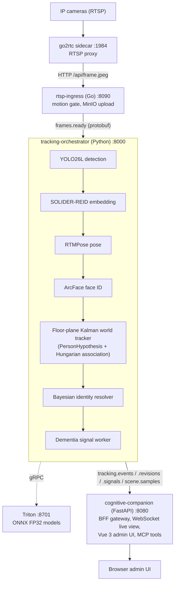
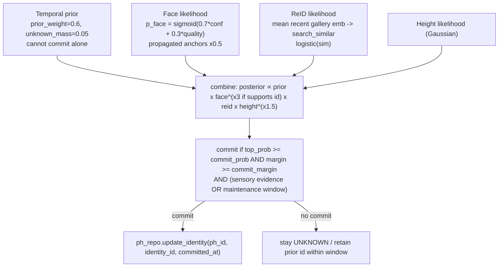
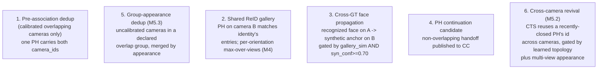

# Systems Architecture: Continuous Tracking System (CTS)

This is the CTS-focused architecture reference: `rtsp-ingress` and `tracking-orchestrator`, the live PersonHypothesis (PH) world-tracker identity model, the home-camera nuances, the settings coupling rule, and the contract by which CTS feeds cognitive-companion (CC). For the CC-side reference (sensors, rules, triggers, steps, the PWA companion view, Gemini integration, and CC bugs/gaps) see `cognitive-companion/docs/systems-architecture.md`.

The code is the source of truth. Some per-repo docs lag behind it (they may still say BoT-SORT, tracklets, or GlobalTrack); the live system uses none of those. Verify a named symbol still exists before relying on it.

## The three systems

- **continuous-tracking/** is the CTS family. **rtsp-ingress** (Go) pulls camera frames through a go2rtc sidecar, motion-gates, uploads JPEGs to MinIO, and publishes `frames.ready`. **tracking-orchestrator** (Python, the ML brain, port 8000) consumes frames and runs detection, tracking, identity resolution, and dementia signals. **triton-shared/** is a sibling library providing the Triton gRPC client shared by CTS and scene-analysis-service.
- **cognitive-companion** (CC, port 8080) is the BFF gateway and rules engine. It consumes the CTS streams, serves the Vue 3 admin UI and MCP tools, and integrates a broad set of sensors and actuators beyond CTS. CC is the only system users and the browser talk to.

Data flow: cameras to go2rtc to rtsp-ingress to `frames.ready` to tracking-orchestrator to `tracking.events` / `tracking.revisions` / `tracking.signals` / `scene.samples` to cognitive-companion to UI, MCP, and rules.

## tracking-orchestrator: tracking and identity model

The architecture is a single floor-plane Kalman world tracker over PersonHypothesis (PH) with a Bayesian identity resolver. It is not BoT-SORT, per-camera tracklets, or GlobalTrack (those were removed).

- **PersonHypothesis (PH)** (`app/domain/__init__.py`, frozen dataclass) is the one cross-camera person entity. `ph_id` (UUID string) is the only person id on the wire. It carries Kalman `state_mean (x, y, vx, vy)` and `state_cov` in floor metres, `gallery_mean` (EMA SOLIDER embedding), `height_estimate_m`, `active_cameras`, `mean_quality` (EMA of CropQuality), and `current_identity_id` plus `current_identity_committed_at`.
- **Frame pipeline** (`app/pipeline/frame_pipeline.py`): 15 ordered `FrameStage`s run by `StageRunner`. A stage is live only if it is in the `stages` list built in `initialize()`.

- **WorldTracker.step** (`app/tracking/world/tracker.py`): predict open PHs, `dedup_observations`, `associate` (Hungarian over `cost_matrix.pair_cost` with a geometric chi-squared gate and an identity-conflict hard gate), update matched (Kalman + EMAs), spawn unmatched, emit `PHContinuationCandidate`, close stale, persist, identity resolution, build snapshots.
- **Identity resolver** (`app/tracking/identity_resolver.py`): posterior over `{identities} + {UNKNOWN}` from a temporal prior (`prior_weight = 0.6`, cannot commit alone), a face likelihood (ArcFace, `face_weight_multiplier = 3.0`), a ReID gallery likelihood (logistic on cosine similarity), and height. Commits when `top_prob >= commit_prob (0.65; dense 0.80)` and `margin >= commit_margin (0.15; dense 0.20)` and sensory evidence is present (or the PH is inside a maintenance window). A face lock at `face_commit_min_confidence = 0.70` holds identity 300 s; prior-only maintenance holds 120 s. The resolver also consumes three-valued face evidence and pose (M3), runs a per-orientation gallery query (M4), and holds a committed identity through evidence gaps (M2.1); see the robustness section below.

- **How a prior PH gets its identity on a good face signal**: FaceIdentityStage emits a `FaceAnchor` keyed by `detection_id`. After association, `WorldTracker._resolve_identities` remaps `tracklet_id` to `ph_id` via `det_to_ph`. The resolver matches the anchor to the PH by `entity_id`. The 3x face weight pushes the posterior past the commit threshold, and `ph_repo.update_identity(...)` is called. If the identity changed, an `IdentityRevision` is published and RevisionsStage retroactively rewrites past trajectory, dwell, and signal rows (`app/services/identity_rewriter.py`).
- **Cross-camera identity** travels six ways (paths 5 and 6 added by M5):

For overlapping cameras with opposite perspectives (front on A, back on B), CTS does not merge observations (their direct similarity is low); both PHs resolve to the same identity through the multi-view gallery and are linked by a **co-presence record** (`co_presence_links`, written when two open PHs in one overlap group share a committed identity).

### Home-camera nuances (load-bearing)

- **Uncalibrated cameras get synthetic floor points, not garbage.** `WorldTrackingStage._synthetic_floor_point` maps the bbox centre into a 4 m virtual room inside a per-camera 200 m tile, flagged `calibrated=False`, so the tracker still creates PHs and commits face-based identities. (Before this, uncalibrated detections were filtered out, so there were no PHs and no identities.)
- **Floor-distance dedup skips `calibrated=False` observations.** Geometric cross-camera dedup does nothing for uncalibrated cameras. For uncalibrated cameras in a declared overlap group, M5.3 adds an appearance-based group dedup path (`enable_group_appearance_dedup`); otherwise identity crosses uncalibrated cameras via the ReID gallery, face propagation, PH continuation, and cross-camera revival.
- **Uncalibrated geometry gates more loosely.** Synthetic floor points jump as a person walks, so M2.3 widens the association gate for `calibrated=False` observations (`uncalibrated_gate_chi2 = 21.0`) and weights appearance over geometry, preventing a turning or walking person from being dropped and respawned.
- **The single quality scorer** is `CropQuality` at `app/pipeline/crop_quality.py`. The formula is `quality = clamp(0.30*area + 0.30*conf + 0.20*kp - 0.4*edge_truncated, 0, 1)` (max 0.60 without pose). It feeds dedup representative selection, ReID likelihood, keyframe sampling, and the PH `mean_quality` EMA that travels to CC. Do not add a second scorer; do not recompute quality on the CC side.

### Robustness: continuity, multi-view, and zero-calibration cross-camera

The robustness milestones (M1 to M6) target the dominant home-deployment failure: a person who turns or walks loses their PH or identity label, the dashboard fills with short-lived PHs, and identity does not survive a camera handoff. The policy under weak evidence is favor continuity: hold a confident identity rather than dropping to UNKNOWN, and minimize PH churn. Each mechanism shipped behind a config flag with a frame-replay proof and an anti-identity-bleed guardrail (a stranger never inherits a resident's identity).

| Mechanism | Where | What it does |
| --- | --- | --- |
| Sticky maintenance (M2.1) | `identity_resolver._evaluate_commit` | Holds a committed identity within the maintenance window unless a recognized different-identity face or a strong contradicting posterior overturns it. A candidate or unrecognized face never contradicts. |
| PH revival (M2.2) | `tracker.py` step 5, `world/revival.py` | Before spawning a new UNKNOWN PH, revives a recently-closed same-camera PH that matches on space, time, and appearance, reusing its `ph_id`, identity, and gallery state. |
| Uncalibrated gate relaxation (M2.3) | `cost_matrix.pair_cost` | Wider geometric gate and appearance-weighted cost for synthetic-floor-point observations. |
| Three-valued face evidence + pose (M3) | `person-identification-service`, `face_identity.py`, resolver | Face evidence is `recognized` / `candidate` / `unrecognized` plus head yaw. A grey-zone candidate corroborates a held identity; a face-present-unknown nudges UNKNOWN without harming a held identity; off-axis matches are down-weighted by frontality. |
| Multi-view ReID (M4) | `orientation.py`, `cost_matrix.py`, resolver `_from_gallery_multiview` | Per-observation body orientation (front/back/left/right) builds view-binned prototypes per PH and per identity. Association and the gallery query match by the best view (max-over-views), so a person who turned around is still retrievable. Online seeding writes orientation-tagged gallery entries only from recognized-face frames. |
| Camera topology (M5.1) | `world/topology.py`, `camera_topology_edges` | Learns directed handoff edges with a transit-time distribution online; gates cross-camera revival by plausible transit time. |
| Cross-camera revival + co-presence (M5.2, M5.3) | `world/revival.py`, `co_presence_links` | Acts on handoffs inside CTS (not just publishing to CC); links overlapping opposite-perspective cameras at the identity level. |

The multi-view gallery query holds residual mass on UNKNOWN for weak matches, so with a single enrolled identity a non-matching body cannot normalize to that identity. Held-identity confidence is replayed on coasting frames (a per-PH in-process cache bounded to open PHs) so a carried identity keeps a meaningful posterior instead of a sentinel 0.

### Settings coupling gotcha

`config/settings.yaml` keys are read in `app/main.py` `_build_*` functions via `section(...).as_float("key")` with no default. Deleting a YAML key without removing its `main.py` read crashes startup with `SettingNotFoundError`; adding a key without a read silently ignores it. Treat the YAML key, the `main.py` read, the dataclass field, and the test as one atomic unit.

## How CTS interacts with cognitive-companion (CC)

CC is the consumer and control plane for CTS. CTS does not serve users directly; everything user-facing is in CC. The integration surface is deliberately narrow:

- **CTS publishes, CC subscribes.** The orchestrator emits protobuf on Redis Streams (see Wire contract below). CC consumes them inside `CTSRuntime` and its subscribers (`backend/services/cts/`): `tracking_event_subscriber` (presence and locations), `identity_revision_subscriber` (applies retroactive identity corrections to CC history), `dementia_signal_subscriber` (fires `dementia_signal`-triggered rules), `ph_continuation_subscriber` (links inferred handoffs), and `scene_sample` consumers.
- **CC owns camera configuration.** There is no static camera list in CTS. `rtsp-ingress` polls `GET /api/v1/cts/cameras` on CC every 60 s; CC stores RTSP URLs (with embedded credentials), room bindings, and enable flags. Operators manage cameras in the CC admin UI.
- **CC drives identity corrections.** The CC BFF `routers/cts_ph.py` proxies the orchestrator `/ph/*` endpoints (`get_ph`, observations, trail, co-present, correct, merge, split, batch_correct). Operator corrections produce `IdentityRevision`s that flow back through CTS and CC history.
- **CC injects evidence back into CTS.** CC can push face assertions (from person-identification-service) that `WorldTrackingStage` matches to observations as `FaceAnchor`s, so CC-side identity knowledge strengthens the CTS posterior.
- **`mean_quality` and identity confidence travel on the wire** from CTS to the CC `PersonLocationEnvelope`. CC does not recompute them.
- **CC enriches CTS signals with caregiver context.** `DementiaSignal`s become alerts only after CC applies per-person `cts_alert_config` gating and rule pipelines; CTS itself never decides whether to notify.

For everything on the CC side (the rules engine and its seven trigger types, event aggregation, the 23 step types, channels and filters, the PWA companion view, Gemini Live realtime voice, Home Assistant and reCamera sensors, and the known CC bugs and gaps) read `cognitive-companion/docs/systems-architecture.md`.

## Wire contract (CTS to CC)

All Redis Streams carry raw protobuf bytes (no JSON, no base64); clients set `decode_responses=False`. Streams: `frames.ready` (FrameReady), `tracking.events` (TrackingEvent), `tracking.revisions` (IdentityRevision), `tracking.signals` (DementiaSignal), `scene.samples` (SceneSample), `tracking.continuations` (PHContinuationCandidate), and the M6 Tier-2 state-change streams `tracking.presence` (PresenceEvent: appeared / disappeared) and `tracking.dwell` (DwellEvent: started / ended with duration). Proto changes are two-repo changes: edit the `.proto`, regenerate bindings in both repos (`make proto`), and update producers, consumers, and tests together; never reuse field numbers. PH `mean_quality` travels via the IdentitySnapshot proto to the CC `PersonLocationEnvelope` `quality` field; do not recompute quality on the CC side.

**Two-tier event model (M6).** `tracking.events` is a high-rate live feed for the UI only, throttled per camera by `live_publish_max_hz` (default 3 Hz; inference still runs every frame). The Tier-2 streams (`tracking.transitions`/room transitions, `tracking.presence`, `tracking.dwell`, `tracking.revisions`, `tracking.signals`) are emitted only on semantic state changes, so the CC rule-trigger rate is a function of human activity, not frame rate times camera count. Raising the inference poll rate to improve tracking no longer increases CC rule load. The CTS-side publish policy is implemented; the CC-side consumer migration (rules triggering off Tier-2 rather than per-frame) is specified for a later effort in `CTS_ROBUSTNESS_M6_*`.

## Conventions that bite if ignored

- Virtual environments: CTS `tracking-orchestrator/.venv`; CC `backend/.venv`. Never use the system Python.
- CTS gates: `make check` (fast), `make ci` (authoritative, Docker, runs the world-tracker replay proofs and PH repository parity). CC gates: `make check`, `make check-all`, `make test-integration`. Tracker or identity changes run in shadow with a mismatch metric and a frame-replay proof before becoming authoritative.
- asyncpg `$1..$N` params only; schema-qualify every table as `continuous_tracking.<table>`; `datetime.now(UTC)` always; frozen dataclasses plus `dataclasses.replace()`; `structlog` only; no silent fallbacks (ruff `BLE001` is an error; stream consumers XACK, warn, and increment `cts_messages_dead_lettered_total`).
- No em-dashes in Markdown. Test at the Protocol boundary with InMemory implementations; assertions must be falsifiable.
